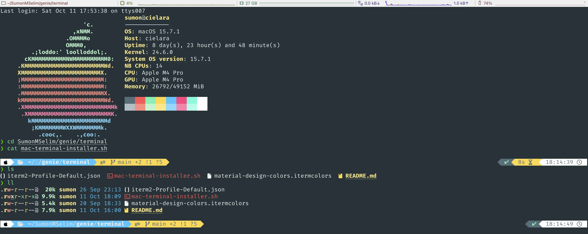
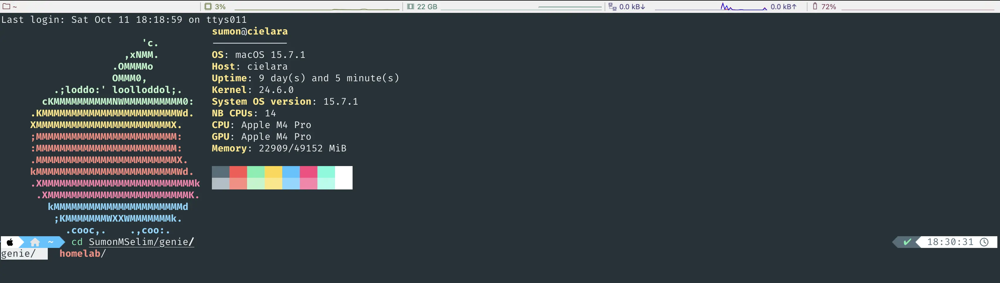

# Terminal Scripts

Terminal setup and configuration utilities to create a powerful, beautiful command-line environment.

## Preview

See what your terminal will look like after setup:

<p>
  
</p>

<p>
  
</p>
---

## macOS Terminal (iTerm2) Installer

**File:** `mac-terminal-installer.sh`

A comprehensive, automated script to transform your macOS terminal into a modern development powerhouse.

#### What It Does

This script automates the complete setup of a professional terminal environment:

1. **Hostname Configuration** (Optional)
    - Set a custom hostname for your Mac
    - Updates all system hostname settings

2. **Package Manager**
    - Installs Homebrew (if not present)
    - Configures PATH for both Intel and Apple Silicon Macs

3. **Shell Setup**
    - Install iterm2 
    - Installs Zsh
    - Sets Zsh as your default shell
    - Installs Oh My Zsh framework

4. **Theme & Appearance**
    - Installs Powerlevel10k theme (modern, fast, customizable)
    - Installs 7 Nerd Fonts with programming ligatures:
        - FiraCode Nerd Font (excellent ligatures)
        - JetBrains Mono Nerd Font (great for coding)
        - Hack Nerd Font (clean and readable)
        - SauceCodePro Nerd Font (Adobe's Source Code Pro)
        - CaskaydiaCove Nerd Font (Microsoft's Cascadia Code)
        - Inconsolata Nerd Font (classic monospace)
        - MesloLGS NF (Powerlevel10k recommended)

5. **Plugins**
    - `git` - Git aliases and completion
    - `brew` - Homebrew completion
    - `macos` - macOS-specific commands
    - `colored-man-pages` - Colorful man pages
    - `command-not-found` - Suggests packages for missing commands
    - `zsh-autosuggestions` - Fish-like command suggestions
    - `zsh-syntax-highlighting` - Real-time syntax highlighting

6. **Modern CLI Tools**
    - `wget` - Download utility
    - `tree` - Directory visualization
    - `bat` - Better `cat` with syntax highlighting
    - `eza` - Modern `ls` replacement with icons
    - `fd` - Better `find` alternative
    - `ripgrep` - Faster `grep` replacement
    - `fzf` - Fuzzy file finder

7. **Custom Configuration**
    - Optimized `.zshrc` with best practices
    - Better history management
    - Useful aliases
    - Modern tool aliases (if available)
    - FZF integration

#### Usage

```bash
./mac-terminal-installer.sh
```

The script will:
- Prompt for a new hostname (optional - just press Enter to skip)
- Request your password when needed (for sudo operations)
- Install and configure everything automatically
- Create a backup of your existing `.zshrc` (if present)

#### Post-Installation

After the script completes:

1. **Restart your terminal** or run:
   ```bash
   exec zsh
   ```

2. **Configure Powerlevel10k:**
   ```bash
   p10k configure
   ```
   This launches an interactive wizard to customize your prompt appearance.

3. **Change Terminal Font:**
    - Open Terminal Preferences (⌘,)
    - Go to Profiles → Text
    - Click "Change" under Font
    - Select one of the installed Nerd Fonts (e.g., "FiraCode Nerd Font")
    - Recommended size: 13-14pt

#### Customization

The generated `.zshrc` includes:
- All plugin configurations
- Custom aliases
- Modern tool integrations
- FZF keybindings

To customize further, edit `~/.zshrc`:
```bash
nano ~/.zshrc
# Then reload:
source ~/.zshrc
```

#### Troubleshooting

**Script fails with "command not found":**
- Ensure you're running on macOS
- Check your internet connection

**Zsh not default after installation:**
- Restart your terminal completely
- Or run: `exec zsh`

**Fonts not showing correctly:**
- Install fonts manually: `brew install --cask font-fira-code-nerd-font`
- Change Terminal font in Preferences
- Restart Terminal app

**Powerlevel10k not loading:**
- Run: `p10k configure`
- Check that the theme line in `.zshrc` is: `ZSH_THEME="powerlevel10k/powerlevel10k"`

**Permission denied errors:**
- Ensure you have admin privileges
- The script will prompt for password when needed

#### Uninstalling

To revert changes:
```bash
# Restore original .zshrc
mv ~/.zshrc.backup ~/.zshrc

# Change shell back to bash
chsh -s /bin/bash
```

#### Learn More

- [Oh My Zsh](https://ohmyz.sh/)
- [Powerlevel10k](https://github.com/romkatv/powerlevel10k)
- [Nerd Fonts](https://www.nerdfonts.com/)
- [Homebrew](https://brew.sh/)

---

**Enjoy your magical terminal! 🧞‍♂️✨**

---

## iTerm2 Profile Configuration

**File:** `iterm2-Profile-Default.json`

A beautifully crafted iTerm2 profile featuring a Material Design-inspired color scheme with optimized settings for modern development.

### Profile Features

**Visual Design:**
- Material Design color palette with dark/light mode support
- 19.8% transparency with blur effect for a modern, sleek look
- Custom ANSI colors optimized for readability
- Separate color schemes for light and dark macOS modes
- Rainbow-colored status bar components

**Font Configuration:**
- **Normal Font:** FiraCode Nerd Font Regular (16pt)
- **Non-ASCII Font:** FiraCode Nerd Font Medium (16pt)
- ASCII ligatures enabled for beautiful code rendering
- Non-ASCII ligatures enabled
- Bold and italic font support

**Status Bar:**
- Working directory display
- CPU utilization monitor
- Memory usage indicator
- Network activity tracker
- Battery status (for laptops)
- Custom color-coded components

**Terminal Settings:**
- Blinking cursor (vertical bar style)
- Cursor shadow enabled
- 1000 lines scrollback
- Visual bell (no sound)
- Draw Powerline glyphs
- Shell integration automatically loaded

**Advanced Features:**
- Mouse reporting enabled
- Window resizing disabled for consistency
- Custom keyboard shortcuts (⌘M)
- 256-color terminal type support
- UTF-8 character encoding

### How to Import

#### Method 1: Via iTerm2 Preferences (Recommended)

1. **Open iTerm2 Preferences:**
   ```
   iTerm2 → Settings (⌘,)
   ```

2. **Navigate to Profiles:**
    - Click on "Profiles" tab
    - Click the "+" button at the bottom to add a new profile

3. **Import the Profile:**
    - Click "Other Actions..." (bottom left)
    - Select "Import JSON Profiles..."
    - Navigate to and select `iterm2-Profile-Default.json`

4. **Set as Default (Optional):**
    - Right-click the imported "Default" profile
    - Select "Set as Default"

#### Method 2: Manual Copy

```bash
# Copy to iTerm2 dynamic profiles directory
mkdir -p ~/Library/Application\ Support/iTerm2/DynamicProfiles
cp iterm2-Profile-Default.json ~/Library/Application\ Support/iTerm2/DynamicProfiles/
```

### Post-Import Setup

After importing the profile:

1. **Verify Font Installation:**
    - The profile uses FiraCode Nerd Font
    - If you've run `mac-terminal-installer.sh`, the font is already installed
    - Otherwise, install it manually:
      ```bash
      brew install --cask font-fira-code-nerd-font
      ```

2. **Restart iTerm2:**
    - Close all windows
    - Quit iTerm2 completely (⌘Q)
    - Reopen iTerm2

3. **Create New Window:**
    - New windows will use the imported profile
    - Or select it from: Profiles → Default

### Customization

You can customize the profile further in iTerm2:

**Colors:**
- Profiles → Colors → Color Presets

**Fonts:**
- Profiles → Text → Font

**Status Bar:**
- Profiles → Session → Status bar enabled
- Configure components via "Configure Status Bar"

**Transparency:**
- Profiles → Window → Transparency (currently set to ~20%)

**Blur:**
- Profiles → Window → Blur (currently set to ~10.3)

---
